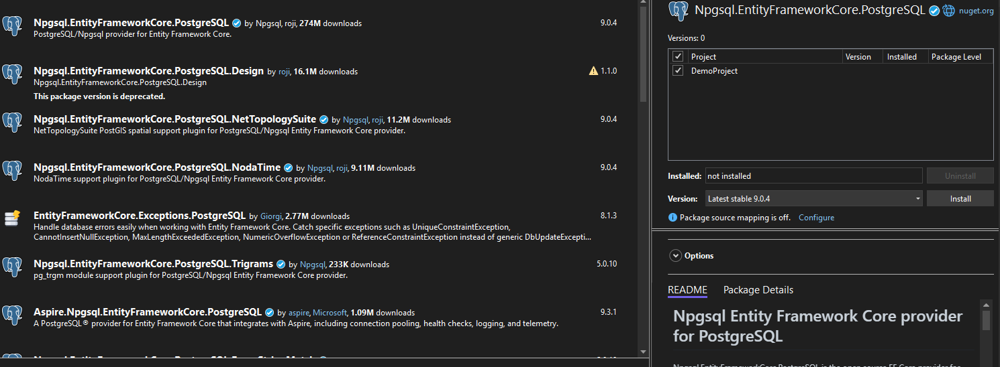

### Visit Microsoft Learn
- [Create a MVC Web App project](https://learn.microsoft.com/en-us/aspnet/core/tutorials/first-mvc-app/start-mvc?view=aspnetcore-9.0)

### Steps
#### Create New Project

#### Search and Select MVC Web App (C#)

#### Write Your Choice of Project Name

#### Keep as it is

#### Run it

#### Got this?


### Database Connection
#### Visit [Supabase](https://supabase.com/) and Create Project->Database(remember password)
#### Select Connect

#### View Parameters of Session Pooler

#### Goto appsettings.json

#### Add you connection string at the top
```sh
"ConnectionStrings": {
    "SupabaseConnection": "Host=<your_supabase_host>;Port=<your_supabase_port>;Database=<your_database_name>;Username=<your_username>;Password=<your_password>"
}
```
#### appsettings.json should look like this (replace the parameters with your database credentials)


#### goto nuget package manager


#### goto browse and search for **Npgsql.EntityFrameworkCore.PostgreSQL**

#### install it (apply -> I accept)


#### Do same for **Microsoft.EntityFrameworkCore.Tools**


#### Install Required Packages (No GUI)


Run these in the **.NET CLI** or **Package Manager Console**:

```bash
Install-Package Microsoft.EntityFrameworkCore.Tools
Install-Package Npgsql.EntityFrameworkCore.PostgreSQL
```

#### Create ***Data/ApplicationDbContext.cs*** (Then inherit from DbContext)


#### goto Program.cs


#### add dbcontext
```sh
builder.Services.AddDbContext<ApplicationDbContext>(options =>
    options.UseNpgsql(builder.Configuration.GetConnectionString("SupabaseConnection")));
```
#### final Program.cs


### MVC


#### Try to Create Some models

#### update **ApplicationDbContext.cs**
```csharp
public DbSet<ClassName> name { get; set; }
```

#### To migrate and see updated tables
- Tools → NuGet Package Manager → Package Manager Console
```sh
Add-Migration Init
Update-Database
```

#### See the result in supabase