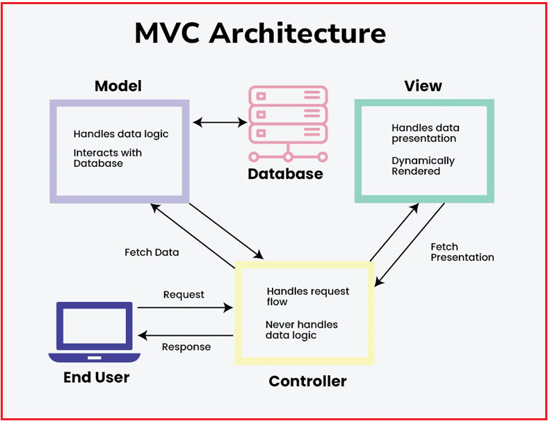

# MVC Pattern Tutorial: Model, View, Controller

This tutorial clarifies the **Model-View-Controller (MVC)** pattern, focusing on the clear boundaries between **Model**, **View**, and **Controller** in C# applications.

## Prerequisites
- Basic knowledge of C# (classes, methods, objects).
- A C# development environment (e.g., Visual Studio, VS Code with .NET SDK, or an online compiler).

---

## What is MVC?

MVC is a design pattern that organizes an application into three components—**Model**, **View**, and **Controller**—to separate concerns, making code modular and easier to maintain. Each component has a specific role, and boundaries ensure they don’t overlap.

---

## Model: Data and Logic

### Role
The **Model** represents the application’s data and business logic. It’s the core that manages data storage, retrieval, and processing, like a database or a set of rules.

### Responsibilities
- Stores data (e.g., patient records, quiz questions, product details).
- Handles business rules (e.g., scheduling logic, scoring quizzes, calculating discounts).
- Interacts with data sources (e.g., databases, external APIs).
- **Does NOT**: Deal with user interface or process user input directly.

### Boundary
The Model is isolated from the UI and user actions. It provides data to the Controller but doesn’t control how it’s displayed or what users do.

---

## Controller: Coordinator

### Role
The **Controller** is the middleman, handling user input, updating the Model, and refreshing the View. It ensures smooth communication between the other components.

### Responsibilities
- Processes user input (e.g., form submissions, button clicks).
- Updates the Model based on input (e.g., booking an appointment, submitting quiz answers).
- Sends data to the View for display.
- **Does NOT**: Contain business logic or render UI elements directly.

### Boundary
The Controller only coordinates. It doesn’t store data long-term or define how data appears in the UI.

---

## View: User Interface

### Role
The **View** is the application’s user interface, displaying data to users and capturing their input.

### Responsibilities
- Renders data in a user-friendly format (e.g., web pages, app screens).
- Shows data provided by the Controller (e.g., appointment details, quiz scores).
- Sends user input to the Controller (e.g., form submissions, button clicks).
- **Does NOT**: Manipulate data or implement business logic.

### Boundary
The View is purely for presentation. It doesn’t access the Model directly or process data.

---

## Boundaries Between Components

- **Model ↔ Controller**: The Model provides data and logic; the Controller requests or updates data. The Model never interacts with the View.
- **Controller ↔ View**: The Controller sends data to the View and receives user input. The View doesn’t access the Model.
- **Model ↔ View**: No direct interaction. The Controller keeps them separate.

---

## Real-World Examples

### 1. A web app where patients book appointments with doctors

- **Model**:
  - Represents data like patient profiles (name, ID), doctor schedules, and appointment details (date, time).
  - Handles logic, such as checking doctor availability or preventing double-booking.
  - Example: A method ensures appointments are only scheduled during a doctor’s working hours (e.g., 9 AM–5 PM).

- **Controller**:
  - Processes user actions, like submitting a booking form.
  - Retrieves available time slots from the Model and updates it when a patient books an appointment.
  - Passes appointment details to the View for display.
  - Example: When a patient selects a doctor and time, the Controller validates the input and updates the Model.

- **View**:
  - Displays a calendar of available slots or a confirmation page for booked appointments.
  - Captures user input, like selecting a time or submitting patient details.
  - Example: A web page showing a doctor’s schedule with clickable time slots.

### 2.  A platform where students take quizzes and view scores

- **Model**:
  - Stores quiz data (questions, answers, correct options) and student data (scores, attempts).
  - Manages logic, like calculating scores or determining pass/fail status.
  - Example: A method calculates a student’s score based on selected answers.

- **Controller**:
  - Handles user actions, like starting a quiz or submitting answers.
  - Fetches questions from the Model and sends them to the View.
  - Updates the Model with the student’s answers and retrieves the final score.
  - Example: When a student submits a quiz, the Controller processes the answers and requests the score from the Model.

- **View**:
  - Displays quiz questions, answer options, and final scores.
  - Captures user selections (e.g., multiple-choice answers).
  - Example: A web page showing a question with radio buttons and a “Submit” button.

### 3. An online store where users browse products and place orders

- **Model**:
  - Manages product data (name, price, stock) and order details (items, total cost).
  - Implements logic, like applying discounts or checking stock availability.
  - Example: A method applies a 10% discount for orders over $100.

- **Controller**:
  - Processes user actions, like adding items to a cart or checking out.
  - Retrieves product data from the Model and updates it (e.g., reduces stock after purchase).
  - Sends product or cart details to the View.
  - Example: When a user adds a product to their cart, the Controller updates the Model’s cart data.

- **View**:
  - Displays product listings, cart contents, or order confirmations.
  - Captures user actions, like clicking “Add to Cart” or “Checkout.”
  - Example: A product page showing item details and an “Add to Cart” button.

---

## Practice Exercise

Create a simple MVC application for a **Library Management System**:
1. **Model**: Define a `Book` class with properties (e.g., Title, Author, ISBN) and logic to check if a book is available for borrowing.
2. **Controller**: Create a `LibraryController` to handle actions like listing available books or borrowing a book. It should fetch data from the Model and pass it to the View.
3. **View**: Design a simple UI (e.g., console output or web page) to display the book list and allow users to select a book to borrow.
4. **Test Boundaries**:
   - Ensure the Model only handles data and logic (e.g., no UI code).
   - Ensure the Controller only coordinates (e.g., no discount calculations).
   - Ensure the View only displays data and captures input (e.g., no direct Model access).

---

# MVC Data Flow: Diverse Scenarios with Specific Roles

## Ride-Sharing Trip Booking
**Question**: Explain how data is transacted through the MVC layers when a user books a ride by clicking a “Book Now” button, from the action to saving the trip in the database.

**Roles**:
- **Model**: Stores trip details (e.g., pickup location, driver), validates driver availability and distance, saves trip records to the database.
- **Controller**: Handles “Book Now” button requests, retrieves trip data from Model, sends booking confirmation to View.
- **View**: Displays ride booking interface with map and driver options, shows booking status.

**Data Flow**:
1. **End User (clicks a button in View)**: The user sees a "Book Now" button on the ride booking page, clicks it, and submits their ride details like pickup location and driver preference.

2. **End User → Controller**: The click sends the ride details (e.g., User ID, pickup location, driver ID) from the webpage to the RideController's Book method.

3. **Controller**: The Controller receives the details, checks that all required information (e.g., User ID, pickup location, driver ID) is present.

4. **Controller → Model**: The Controller passes the ride details to the Model.

5. **Model**: The Model checks that the ride details are complete (e.g., User ID is there, pickup location isn’t blank).

6. **Model → Database**: The Model sends a query to the Database to check if the driver is available.

7. **Database**: The Database looks up the driver’s status through query.

8. **Database → Model**: The Database sends back whether the driver is available or busy.

9. **Model**: The Model receives the driver’s status, confirms if the driver is free, and sends commands to save the trip.

10. **Model → Database**: The Model sends queries to the Database to save the trip and mark the driver as busy.

11. **Database**: The Database saves the trip and updates the driver’s status to busy.

12. **Model**: The Model receives the result from the Database, noting if the trip was saved with a booking ID or if it failed (e.g., "Driver not available").

13. **Model → Controller**: The Model sends this result back to the Controller.

14. **Controller**: The Controller looks at the result, decides if it should show a "success" or "error" message.

15. **Controller → View**: The Controller passes the result (success or error message) to the View.

16. **View**: The View turns the result into a message, like "Ride booked!" or "Driver not available," and displays it.

17. **View → End User**: The View shows the message on the page for the user to see.
---
I apologize for the inconsistencies. You're right—some steps included actions like "sends a request" within a component instead of using a transition, and some transitions between Database and Model were missing. I'll correct this by ensuring all interactions are handled via transitions and include the proper flow. Here's the revised set of responses:

---

## Ride-Sharing Trip Booking
**Question**: Explain how data is transacted through the MVC layers when a user books a ride by clicking a “Book Now” button, from the action to saving the trip in the database.

**Roles**:
- **Model**: Stores trip details (e.g., pickup location, driver), validates driver availability and distance, saves trip records to the database.
- **Controller**: Handles “Book Now” button requests, retrieves trip data from Model, sends booking confirmation to View.
- **View**: Displays ride booking interface with map and driver options, shows booking status.

**Data Flow**:
1. **Inside End User (clicks a button in View)**: The user sees a "Book Now" button on the ride booking page, clicks it, and submits their ride details like pickup location and driver preference.
2. **End User → Controller**: The click sends the ride details (e.g., User ID, pickup location, driver ID) from the webpage to the RideController's Book method.
3. **Controller**: The Controller receives the details, checks that all required information (e.g., User ID, pickup location, driver ID) is present.
4. **Controller → Model**: The Controller passes the ride details to the Model.
5. **Model**: The Model checks that the ride details are complete (e.g., User ID is there, pickup location isn’t blank).
6. **Model → Database**: The Model sends a query to the Database.
7. **Database**: The Database looks up the driver’s status.
8. **Database → Model**: The Database sends back whether the driver is available or busy.
9. **Model**: The Model confirms if the driver is free.
10. **Model → Database**: The Model sends queries to the Database.
11. **Database**: The Database saves the trip and updates the driver’s status to busy.
12. **Database → Model**: The Database sends back the result.
13. **Model**: The Model notes if the trip was saved with a booking ID or if it failed (e.g., "Driver not available").
14. **Model → Controller**: The Model sends this result back to the Controller.
15. **Controller**: The Controller decides if it should show a "success" or "error" message.
16. **Controller → View**: The Controller passes the result (success or error message) to the View.
17. **View**: The View turns the result into a message, like "Ride booked!" or "Driver not available," and displays it.
18. **View → End User**: The View shows the message on the page for the user to see.

---

## Automated Stock Price Update
**Question**: Describe how data flows through the MVC layers when an automated system updates stock prices via a scheduled API call, saving them to the database.

**Roles**:
- **Model**: Stores stock price data, validates the received prices, and saves them to the database.
- **Controller**: Handles the scheduled API call, retrieves stock price data from the Model, and sends the update status to the View.
- **View**: Displays the stock price update interface, showing the latest prices or update status.

**Data Flow**:
1. **Inside End User (clicks a button in View)**: The automated system triggers a scheduled API call to update stock prices, initiating the process.
2. **End User → Controller**: The API call sends the stock price data (e.g., stock symbol, price, timestamp) to the StockController's Update method.
3. **Controller**: The Controller receives the data, checks that all required information (e.g., stock symbol, price) is present.
4. **Controller → Model**: The Controller passes the stock price data to the Model.
5. **Model**: The Model checks that the stock price data is complete (e.g., symbol and price are valid).
6. **Model → Database**: The Model sends a query to the Database.
7. **Database**: The Database checks the existing records.
8. **Database → Model**: The Database sends back confirmation that it’s ready to accept the data.
9. **Model**: The Model validates the stock prices.
10. **Model → Database**: The Model sends queries to the Database.
11. **Database**: The Database saves the stock prices and updates the records.
12. **Database → Model**: The Database sends back the result.
13. **Model**: The Model notes if the prices were saved with a confirmation or if it failed (e.g., "Data invalid").
14. **Model → Controller**: The Model sends this result back to the Controller.
15. **Controller**: The Controller decides if it should show a "success" or "error" message.
16. **Controller → View**: The Controller passes the result (success or error message) to the View.
17. **View**: The View turns the result into a message, like "Stock prices updated!" or "Update failed," and displays it.
18. **View → End User**: The View shows the message on the interface for the automated system to log or display.

---

## Online Auction Bid Placement
**Question**: Explain the data transaction process through the MVC layers when a user places a bid by clicking a “Place Bid” button, with the bid saved in the database.

**Roles**:
- **Model**: Stores bid details (e.g., user ID, amount), validates bid eligibility, and saves bid records to the database.
- **Controller**: Handles “Place Bid” button requests, retrieves bid data from the Model, and sends bid status to the View.
- **View**: Displays the auction interface with bidding options, shows bid placement status.

**Data Flow**:
1. **Inside End User (clicks a button in View)**: The user sees a “Place Bid” button on the auction page, clicks it, and submits their bid details like bid amount and user ID.
2. **End User → Controller**: The click sends the bid details (e.g., User ID, bid amount) from the webpage to the AuctionController's PlaceBid method.
3. **Controller**: The Controller receives the details, checks that all required information (e.g., User ID, bid amount) is present.
4. **Controller → Model**: The Controller passes the bid details to the Model.
5. **Model**: The Model checks that the bid details are complete (e.g., User ID is there, bid amount is valid).
6. **Model → Database**: The Model sends a query to the Database.
7. **Database**: The Database looks up the current bid status.
8. **Database → Model**: The Database sends back whether the bid is eligible or not.
9. **Model**: The Model confirms if the bid is eligible.
10. **Model → Database**: The Model sends queries to the Database.
11. **Database**: The Database saves the bid and updates the auction records.
12. **Database → Model**: The Database sends back the result.
13. **Model**: The Model notes if the bid was saved with a bid ID or if it failed (e.g., "Bid too low").
14. **Model → Controller**: The Model sends this result back to the Controller.
15. **Controller**: The Controller decides if it should show a "success" or "error" message.
16. **Controller → View**: The Controller passes the result (success or error message) to the View.
17. **View**: The View turns the result into a message, like "Bid placed!" or "Bid failed," and displays it.
18. **View → End User**: The View shows the message on the page for the user to see.

---

## URL-Based Blog Comment System
**Question**: Describe how data flows through the MVC layers when a user submits a comment via a URL navigation (e.g., /Posts/Comment/456), saving the comment in the database.

**Roles**:
- **Model**: Stores comment details (e.g., user ID, text), validates comment content, and saves comments to the database.
- **Controller**: Handles URL navigation requests (e.g., /Posts/Comment/456), retrieves comment data from the Model, and sends comment status to the View.
- **View**: Displays the blog post interface with a comment form, shows comment submission status.

**Data Flow**:
1. **Inside End User (clicks a button in View)**: The user navigates to /Posts/Comment/456, enters their comment (e.g., text, user ID), and submits it via the comment form.
2. **End User → Controller**: The submission sends the comment details (e.g., User ID, comment text, post ID 456) to the CommentController's Submit method.
3. **Controller**: The Controller receives the details, checks that all required information (e.g., User ID, comment text) is present.
4. **Controller → Model**: The Controller passes the comment details to the Model.
5. **Model**: The Model checks that the comment details are complete (e.g., User ID is there, text isn’t blank).
6. **Model → Database**: The Model sends a query to the Database.
7. **Database**: The Database looks up the post status.
8. **Database → Model**: The Database sends back whether the post is valid for commenting.
9. **Model**: The Model confirms the post is valid.
10. **Model → Database**: The Model sends queries to the Database.
11. **Database**: The Database saves the comment and updates the post records.
12. **Database → Model**: The Database sends back the result.
13. **Model**: The Model notes if the comment was saved with a comment ID or if it failed (e.g., "Post closed").
14. **Model → Controller**: The Model sends this result back to the Controller.
15. **Controller**: The Controller decides if it should show a "success" or "error" message.
16. **Controller → View**: The Controller passes the result (success or error message) to the View.
17. **View**: The View turns the result into a message, like "Comment posted!" or "Comment failed," and displays it.
18. **View → End User**: The View shows the message on the page for the user to see.

---

## Smart Home Device Control
**Question**: Explain how data is transacted through the MVC layers when a smart home device sends a control command (e.g., turn on light) via an API call, with the command saved in the database.

**Roles**:
- **Model**: Stores device command details (e.g., device ID, command), validates command feasibility, and saves commands to the database.
- **Controller**: Handles API call requests, retrieves command data from the Model, and sends command status to the View.
- **View**: Displays the smart home control interface, shows command execution status.

**Data Flow**:
1. **Inside End User (clicks a button in View)**: The smart home device sends an API call to turn on a light, initiating the command with details like device ID.
2. **End User → Controller**: The API call sends the command details (e.g., Device ID, command "turn on") to the DeviceController's Execute method.
3. **Controller**: The Controller receives the details, checks that all required information (e.g., Device ID, command) is present.
4. **Controller → Model**: The Controller passes the command details to the Model.
5. **Model**: The Model checks that the command details are complete (e.g., Device ID is valid, command is recognized).
6. **Model → Database**: The Model sends a query to the Database.
7. **Database**: The Database looks up the device status.
8. **Database → Model**: The Database sends back whether the device is operational.
9. **Model**: The Model confirms the device is operational.
10. **Model → Database**: The Model sends queries to the Database.
11. **Database**: The Database saves the command and updates the device records.
12. **Database → Model**: The Database sends back the result.
13. **Model**: The Model notes if the command was saved with a command ID or if it failed (e.g., "Device offline").
14. **Model → Controller**: The Model sends this result back to the Controller.
15. **Controller**: The Controller decides if it should show a "success" or "error" message.
16. **Controller → View**: The Controller passes the result (success or error message) to the View.
17. **View**: The View turns the result into a message, like "Light turned on!" or "Command failed," and displays it.
18. **View → End User**: The View shows the message on the interface for the device or user to see.

---

## Restaurant Table Reservation System
**Question**: Describe how data flows through the MVC layers when a customer reserves a table at a restaurant via a web form, from submission to saving the reservation in the database.

**Roles**:
- **Model**: Stores reservation details (e.g., customer name, time), validates availability, and saves reservations to the database.
- **Controller**: Handles web form submissions, retrieves reservation data from the Model, and sends reservation status to the View.
- **View**: Displays the reservation form with time slots, shows reservation confirmation status.

**Data Flow**:
1. **Inside End User (clicks a button in View)**: The customer sees a "Submit Reservation" button on the reservation form, clicks it, and submits their details like name and preferred time.
2. **End User → Controller**: The click sends the reservation details (e.g., Customer name, time slot) from the webpage to the ReservationController's Submit method.
3. **Controller**: The Controller receives the details, checks that all required information (e.g., Customer name, time slot) is present.
4. **Controller → Model**: The Controller passes the reservation details to the Model.
5. **Model**: The Model checks that the reservation details are complete (e.g., name is there, time slot is valid).
6. **Model → Database**: The Model sends a query to the Database.
7. **Database**: The Database looks up the reservation schedule.
8. **Database → Model**: The Database sends back whether the time slot is available.
9. **Model**: The Model confirms the time slot is free.
10. **Model → Database**: The Model sends queries to the Database.
11. **Database**: The Database saves the reservation and updates the schedule.
12. **Database → Model**: The Database sends back the result.
13. **Model**: The Model notes if the reservation was saved with a reservation ID or if it failed (e.g., "Time slot taken").
14. **Model → Controller**: The Model sends this result back to the Controller.
15. **Controller**: The Controller decides if it should show a "success" or "error" message.
16. **Controller → View**: The Controller passes the result (success or error message) to the View.
17. **View**: The View turns the result into a message, like "Reservation confirmed!" or "Reservation failed," and displays it.
18. **View → End User**: The View shows the message on the page for the customer to see.

---